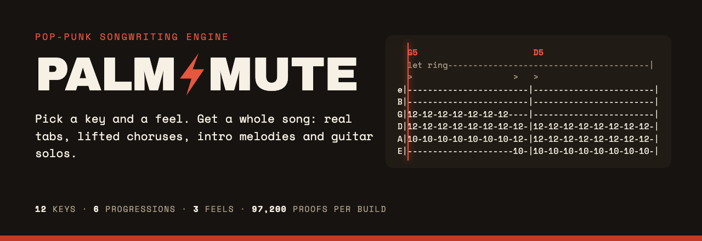
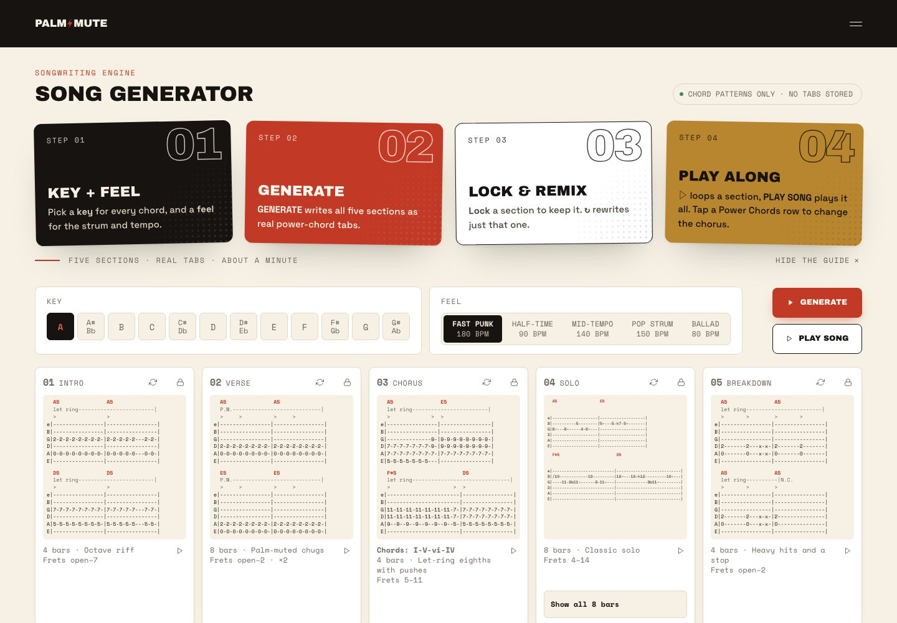
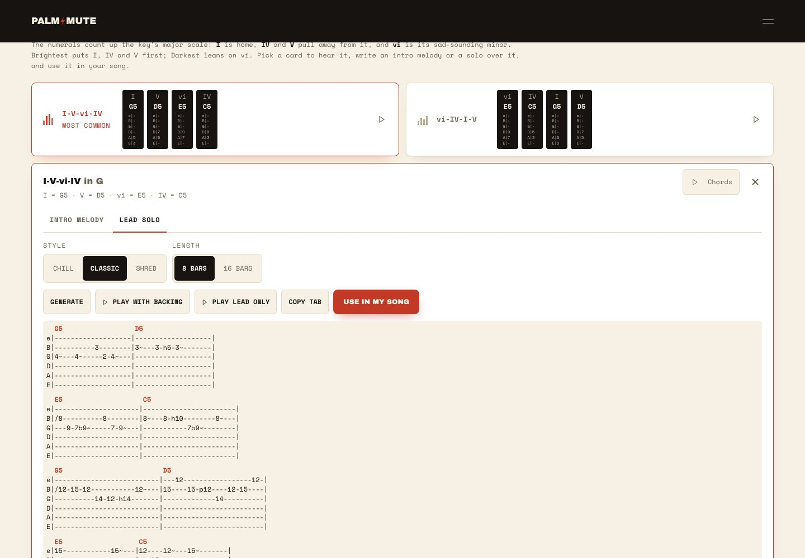
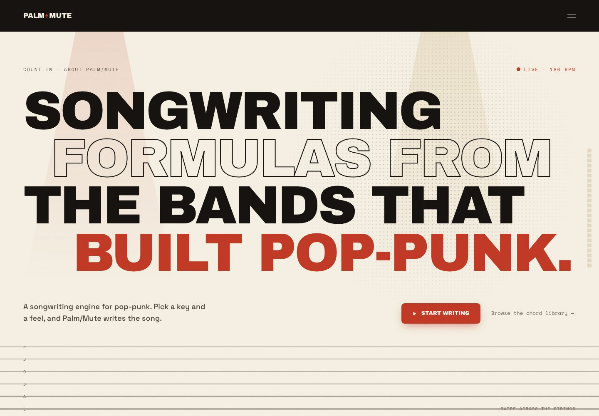
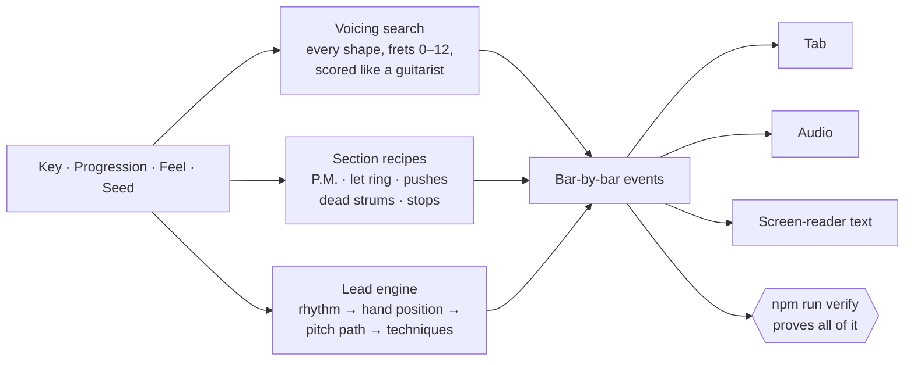

<p align="center">
  <a href="https://palmmute.netlify.app"></a>
</p>

<p align="center">
  <a href="https://palmmute.netlify.app"></a>
  <a href="https://github.com/WIPNHPT1/palm-mute/actions/workflows/build-check.yml"></a>
  
  
  
  
</p>

<h3 align="center">The only pop-punk song generator we know of that proves every tab it writes.</h3>
<p align="center">222,000 combinations checked on every build. Zero wrong notes allowed.<br>
<a href="https://palmmute.netlify.app"><b>▶ Write a song now</b></a> · <a href="docs/HOW-IT-WORKS.md">How it works</a> · <a href="DECISIONS.md">Design decisions</a></p>

---

## Spec sheet

| | |
|---|---|
| **Tuning** | E standard |
| **Keys** | All 12, with sharps and flats named properly (A#/Bb) |
| **Progressions** | The 10 that pop-punk actually runs on (I-V-vi-IV, vi-IV-I-V, I-IV-V, I-V-IV-V, vi-V-IV, IV-I-V-vi, I-vi-IV-V, I-IV-vi-V, V-vi-IV-I, I-V-IV), sortable six ways |
| **Feels** | Fast Punk (180 BPM), Half-Time (same click, half the snare), Mid-Tempo (120–150 BPM, adjustable), Pop Strum (150 BPM, open down-up strum), Ballad (80 BPM, let ring) |
| **Song sections** | Intro · Verse · Chorus · Solo · Breakdown, each lockable and regenerable on its own |
| **Chord shapes** | 2-note, 3-note (octave), inverted, open-string and octave-riff power chords, frets 0–12 |
| **Leads** | Intro melodies (Hook, Octaves, Harmony) and solos (Chill, Classic, Shred), frets 0–12 and 0–15 |
| **Techniques** | Palm mutes, let-ring, accents, pushes, dead strums, stops · bends, hammer-ons, pull-offs, slides, vibrato |
| **Tabs** | Real bars of 8 eighth notes, 2 bars per line, never scroll sideways, readable at 320px |
| **Audio** | Synthesized in the browser (Tone.js): plays exactly the notes in the tab, with drums at the chosen feel |
| **Proof** | 42,000 voicing renders covering 150,000 section combinations, plus 72,000 leads, on every build ([see below](#receipts)) |
| **Accessibility** | 44px tap targets, 12px minimum text, 4.5:1 contrast in light and dark, screen readers hear note names instead of dashes |
| **Backend** | None. It's a static site; nothing you make leaves your browser |

## What you get that a chord list doesn't give you

| A chord list | Palm/Mute |
|---|---|
| `G  D  Em  C` | Where on the neck to play them, and a path that keeps your hand still (the Verse shares a fret between G5 and D5) |
| One shape per chord | Low palm-muted chugs for the verse, then a chorus that **lifts** 5 frets with big 3-note shapes |
| No rhythm | P.M., let ring, accents, **pushes** (the next chord an eighth early), dead strums and a full-band stop |
| No lead | An intro hook that states a motif and answers it, and a solo that builds, peaks with a bend and lands on the root |
| "Trust me" | Every note is checked by code: right pitch, right string, playable stretch, inside the fret limit |

## Screenshots

<table>
<tr>
<td width="50%"><picture><source media="(prefers-color-scheme: dark)" srcset="docs/readme/generator-dark.jpg"></picture><p align="center"><b>Generator:</b> a whole song in one screen</p></td>
<td width="50%"><picture><source media="(prefers-color-scheme: dark)" srcset="docs/readme/chords-dark.jpg"></picture><p align="center"><b>Chords:</b> write a solo over any progression</p></td>
</tr>
<tr>
<td colspan="2"><picture><source media="(prefers-color-scheme: dark)" srcset="docs/readme/count-in-dark.jpg"></picture><p align="center"><b>Count In:</b> the home page (screenshots follow your GitHub theme)</p></td>
</tr>
</table>

## Real output

Key of G, I-V-vi-IV, Fast Punk, seed 0. Straight from the engine, nothing hand-edited.

**Verse:** palm-muted chugs in the low zone. D5 will share the A-string 5th fret with G5.
```
  G5               G5
  P.M.----------------------------|
  >     >          >     >
e|----------------|----------------|
B|----------------|----------------|
G|----------------|----------------|
D|----------------|----------------|
A|5-5-5-5-5-5-5-5-|5-5-5-5-5-5-5-5-|
E|3-3-3-3-3-3-3-3-|3-3-3-3-3-3-3-3-|
```

**Chorus:** lifted to frets 10–12, let ring, and D5 **pushed** onto the last eighth of bar 1.
```
  G5                       D5
  let ring----------------------------------------|
  >                    >   >
e|------------------------|------------------------|
B|------------------------|------------------------|
G|12-12-12-12-12-12-12----|------------------------|
D|12-12-12-12-12-12-12-12-|12-12-12-12-12-12-12-12-|
A|10-10-10-10-10-10-10-12-|12-12-12-12-12-12-12-12-|
E|---------------------10-|10-10-10-10-10-10-10-10-|
```

**Solo (Classic), bars 3–4:** a slide into a new position, whole-step bends from D to E (both in the scale), a hammer-on and vibrato.
```
  E5                    C5
e|---------------------|-----------------------|
B|/8----------8--------|8~---8-h10--------8~---|
G|---9-7b9~-----7-9~---|-----------7b9~--------|
D|---------------------|-----------------------|
A|---------------------|-----------------------|
E|---------------------|-----------------------|
Em: G E D^E · G D E ·
C:  G · G A D^E · G ·
```

## How it thinks



Tab, audio and screen-reader text all come from **one** set of events, so what you see is what you hear. The details, including the music theory and hand-checked examples, are in **[docs/HOW-IT-WORKS.md](docs/HOW-IT-WORKS.md)**.

## Receipts

`npm run verify` runs on every pull request and every push to `main`:

```text
$ npm run verify
All data-layer checks passed.
Voicing engine: 42000 distinct section renders checked, covering 12 keys × 10 progressions × 5 feels
× 5 sections × 50 seeds (only the Chorus depends on the progression), 0 recorded position shifts,
12 reference tabs.
All voicing-engine checks passed.
Lead engine: 72000 leads checked (12 keys × 10 progressions × 2 parts × 3 styles × 2 lengths × 50 seeds);
95.5% of strong beats on chord notes; … brief §4 hook + 9 reference outputs.
All lead-engine checks passed.
```

What "checked" means:
- **Every chord** is exactly root + fifth (+ octave), on the right degree of the key, with a stretch of 3 frets or less, never above fret 12, and never in a rare shape.
- **Every tab** is parsed back from its own text and compared, cell by cell, with what the audio engine plays.
- **Every lead** stays in the scale, lands at least 75% of strong beats on chord notes, never leaps more than a fifth, steps back after big leaps, and ends on the root or 3rd. It only bends from a scale note to a scale note: in G, A→B passes and B→C# is rejected.
- **Hand-checked references** at seed 0 must match exactly.

Then Playwright runs **750+ browser checks** in Chromium and WebKit, from 320px to 1920px, in light and dark: layout, tap targets, contrast, audio = tab, and more.

## Run it

```bash
npm ci
npm run dev          # http://localhost:3000
```

| Command | What it does |
|---|---|
| `npm run build` | Static export to `out/` (what Netlify serves) |
| `npm run lint` | ESLint over every source folder |
| `npm run verify` | The music proofs above (about a minute) |
| `npm run test:e2e` | Playwright: builds, serves `out/`, runs Chromium + WebKit × 5 widths × 2 themes |
| `npm run generate:chords` | Regenerates `data/chord-library.json` from the shape data |
| `npm run build:brand` / `build:readme` | Regenerates icons and share images / this README's images |

## Under the hood

Next.js 15 (static export) · React 18 · Tailwind 3 (design tokens in `tailwind.config.js`) · Tone.js · Playwright · Netlify.

All musical content and tuning lives in `data/*.json`: shapes, engine weights, section recipes, lead rules and rhythms. The engines in `lib/` are pure TypeScript with no React, so they can be tested exhaustively.

| Where | What |
|---|---|
| `lib/voicings.ts` | Voicing candidates, guitarist scoring, branch-and-bound path search |
| `lib/generator.ts` | Section recipes → bar events → tabs |
| `lib/melody.ts` | Intro melodies and solos |
| `lib/fretboard.ts` | String maths, pitch checks, tab rendering |
| `docs/` | The engine briefs, [how it works](docs/HOW-IT-WORKS.md), and two playable mock-ups for guitarists to review |
| `DECISIONS.md` | Every design call and why |

<p align="center"><sub>Made for playing along with. Plug in, pick a key, count it in: one, two, three, four.</sub></p>
